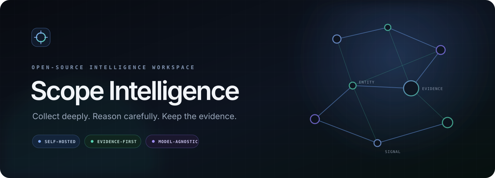
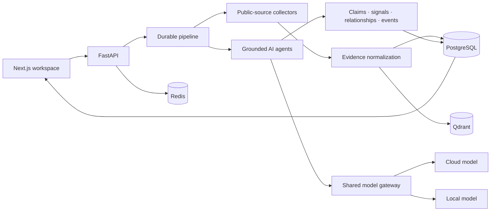

<p align="center">
  
</p>

<p align="center">
  <a href="https://github.com/Samarth-23-eng/osint-platform/actions/workflows/ci.yml"></a>
  <a href="./LICENSE"></a>
  
  
  
  
  
  <a href="./CONTRIBUTING.md"></a>
</p>

<p align="center">
  <strong>Turn public web evidence into attributable company intelligence.</strong><br>
  Scope Intelligence is a self-hosted OSINT research workspace for collection,
  evidence retrieval, relationship mapping, monitoring, and AI-assisted analysis.
</p>

<p align="center">
  <a href="#quick-start">Quick start</a> ·
  <a href="#what-it-does">Features</a> ·
  <a href="./docs/ARCHITECTURE.md">Architecture</a> ·
  <a href="./ROADMAP.md">Roadmap</a> ·
  <a href="./CONTRIBUTING.md">Contribute</a>
</p>

> [!CAUTION]
> **Pre-alpha research software.** Scope Intelligence is an unfinished test
> platform, not a production intelligence service. Social Collection Studio
> and Deep Research Lab are **experimental** and may surface explicit, graphic,
> sexual, violent, hateful, malicious, unlawful, false, or otherwise disturbing
> public content. Results are not safety-vetted or verified. Use a disposable,
> isolated local environment, minimize retention, and review every result before
> relying on or sharing it.

> [!IMPORTANT]
> Scope is intended only for lawful, authorized research using public sources.
> It does not bypass authentication, CAPTCHAs, paywalls, or technical access
> controls. Operators are responsible for applicable law, source policies,
> data protection, and safe handling of collected material.

<table>
  <tr>
    <td><strong>Evidence first</strong><br><sub>Versioned sources, citations, provenance, and review state.</sub></td>
    <td><strong>One model route</strong><br><sub>Encrypted BYOK for cloud, local, and compatible providers.</sub></td>
  </tr>
  <tr>
    <td><strong>Relationship intelligence</strong><br><sub>Entities, corroboration, contradictions, paths, and graph change.</sub></td>
    <td><strong>Self-hosted workspace</strong><br><sub>Local services, bounded collectors, inspectable runs, and operator control.</sub></td>
  </tr>
</table>

## Why Scope Intelligence?

Most monitoring tools either collect links without reasoning or generate AI
summaries without traceable evidence. Scope Intelligence keeps collection,
retrieval, analysis, and review connected:

- every collected document is versioned and searchable;
- supported claims retain citations to evidence or document chunks;
- relationship edges record provenance, freshness, corroboration, and
  contradictions;
- agents share one operator-selected model through an encrypted BYOK gateway;
- pipeline runs, retries, failures, and output-quality diagnostics remain
  inspectable.

The result is a research system that helps an operator move from a company
name to a reviewable intelligence picture—not a black-box answer.

## What it does

| Capability | Included |
| --- | --- |
| Company discovery | Name-first identity resolution; a domain is helpful but not required |
| Hybrid collection | HTTP and browser rendering, sitemaps, RSS/Atom, PDFs, public profiles, jobs, news, GitHub, and bounded YouTube metadata |
| Social Collection Studio | **Experimental pre-alpha:** bounded YouTube channels, videos, transcripts, and public comments with normalized evidence |
| Deep Research Lab | **Experimental pre-alpha:** opt-in, GET-only research over publicly reachable Tor hidden services |
| Evidence foundation | Immutable document versions, chunks, lexical + vector retrieval, source health, and citation integrity |
| AI research | Grounded summaries, signals, predictions, focused investigations, structured-output repair, and quality telemetry |
| Relationship intelligence | Entity resolution, aliases, temporal observations, corroboration, contradictions, graph metrics, and evidence inspection |
| Continuous monitoring | Per-company schedules, change detection, activity history, alert severity policies, and operator-triggered runs |
| Verification | Deterministic claim reassessment, source reliability, review queues, and human decisions |
| Situation timeline | Fused events, momentum, impact, verification state, and correlated developments |
| Reports and alerts | PDF briefs plus optional email and Discord delivery |
| Model gateway | OpenAI, OpenRouter, Anthropic, Gemini, Ollama, LM Studio, and custom OpenAI-compatible endpoints |

## Experimental research labs

The labs are deliberately separated from the normal collection pipeline and
disabled or bounded by workspace controls. They are test features for local
evaluation, not promises of accuracy, availability, or safety.

### Social Collection Studio

- Collects bounded public channel, video, transcript, and comment evidence.
- Public comments and transcripts may contain explicit or disturbing material.
- Commenter identity is minimized; collected material still requires human
  review and responsible retention.

### Deep Research Lab

- Searches publicly reachable version-3 `.onion` services through an isolated
  Tor container.
- Uses GET-only requests with no authentication, form submission, uploads,
  downloads, or arbitrary target URLs.
- Treats every result as untrusted, low-confidence evidence requiring
  corroboration.
- May expose graphic, illegal, fraudulent, extremist, or otherwise harmful
  material even when the research query is benign.

Read [Experimental Labs](docs/EXPERIMENTAL_LABS.md),
[Deep Research Lab](docs/DEEP_RESEARCH_LAB.md), and
[Ethical Use](docs/ETHICAL_USE.md) before enabling either workflow.

## Quick start

### Requirements

- Docker Desktop with Docker Compose
- 8 GB RAM recommended
- A model provider key or a local Ollama/LM Studio server for AI analysis

### 1. Clone and configure

```bash
git clone https://github.com/Samarth-23-eng/osint-platform.git
cd osint-platform
cp .env.example .env
```

On Windows PowerShell, use `Copy-Item .env.example .env`.

Set a unique `POSTGRES_PASSWORD` in `.env`. Optional source credentials can
remain blank.

### 2. Start the platform

```bash
docker compose up --build
```

Open:

- Dashboard: [http://localhost:3000](http://localhost:3000)
- API health: [http://localhost:8000/health](http://localhost:8000/health)
- API documentation: [http://localhost:8000/docs](http://localhost:8000/docs)

If port `3000` is unavailable, set:

```dotenv
DASHBOARD_PORT=3200
CORS_ORIGINS=http://localhost:3200
```

### 3. Connect a model

Open **Settings > AI & agents** in the dashboard and choose a provider, base URL,
model ID, and authentication method. Save and test the connection once; every
AI agent will use that model.

Credentials entered in the dashboard are encrypted before PostgreSQL storage
and are never returned by the API. Headless installations can instead use the
`LLM_*` variables documented in [.env.example](.env.example).

### 4. Start researching

Enter a company, subsidiary, regional office, brand, or business unit. The
discovery flow creates a name-first profile and expands through public evidence
even when no official domain can be verified.

### Optional: start the Deep Research Tor service

Deep Research remains disabled by default. To test it locally, start the
isolated service and then enable the lab under **Settings > Collection**:

```bash
docker compose --profile deep-research up -d tor
```

## System architecture



See [docs/ARCHITECTURE.md](docs/ARCHITECTURE.md) for data flow, trust
boundaries, and extension points.

## Collection principles

Scope Intelligence favors depth with accountability:

1. **Public and attributable:** retain canonical URLs, timestamps, source
   identity, and collection diagnostics.
2. **Bounded:** every source has explicit time, page, depth, concurrency, and
   retry budgets.
3. **Resumable:** crawl frontiers and pipeline tasks survive interruptions.
4. **Isolated:** one blocked or unavailable source does not fail the entire run.
5. **Reviewable:** failures and weak evidence remain visible instead of being
   silently discarded.
6. **Respectful:** robots directives are honored by default and experimental
   sources are opt-in.

Read [docs/ETHICAL_USE.md](docs/ETHICAL_USE.md) before adding or operating a
new collector.

## Model providers

One connection is shared across all agents to make cost, behavior, and
evaluation predictable.

| Provider type | Authentication |
| --- | --- |
| OpenAI / OpenRouter | API key |
| Anthropic | API key or existing bearer token |
| Google Gemini | API key or existing bearer token |
| Ollama / LM Studio | None for a trusted local server |
| Custom OpenAI-compatible | API key, bearer token, or none |

Automatic provider-specific OAuth browser flows are not included yet. Existing
OAuth access tokens can be stored using bearer authentication.

## Repository guide

```text
agents/          Collection, enrichment, discovery, analysis, and orchestration
alerts/          Alert evaluation plus optional delivery adapters
api/             FastAPI application and report routes
config/          Typed environment configuration
dashboard/       Next.js operator workspace
db/              PostgreSQL, Redis, Qdrant, and additive SQL migrations
intelligence/    Evidence, retrieval, graph, verification, monitoring, and events
llm_gateway/     Provider-neutral model connection and encrypted credentials
reports/         PDF intelligence brief generation
tests/           Backend unit and contract tests
docs/            Architecture, setup, safety, and troubleshooting guides
```

## Development

```bash
python -m venv .venv
python -m pip install -r requirements-dev.txt
python -m playwright install chromium
python -m pytest -q

cd dashboard
npm ci
npm run lint
npm run build
```

Detailed platform-specific instructions are in
[docs/DEVELOPMENT.md](docs/DEVELOPMENT.md).

## Contributing

Contributions are welcome—from first-time contributors and experienced OSINT,
data, backend, AI, security, and frontend engineers.

- Start with [CONTRIBUTING.md](CONTRIBUTING.md).
- Use the structured issue forms for bugs, features, and source adapters.
- Review the [roadmap](ROADMAP.md) and
  [governance model](GOVERNANCE.md).
- Follow the [Code of Conduct](CODE_OF_CONDUCT.md).
- Never submit real credentials or private investigation data.

Good first contributions include documentation fixes, new unit tests,
accessibility improvements, source reliability rules, collection diagnostics,
and adapters for official public APIs.

## Security

The default Compose configuration binds the dashboard and API to
`127.0.0.1`. Do not expose them directly to the internet. For vulnerabilities
or leaked credentials, follow [SECURITY.md](SECURITY.md) and do not open a
public issue.

## Project status

Scope Intelligence is **pre-alpha** and under active development. The evidence model,
relationship fusion, monitoring, verification, event timeline, and shared
model gateway are implemented; multi-user authentication, export formats, and
larger-scale deployment controls remain roadmap items. Experimental labs may
change incompatibly or be removed while their safety and evidence quality are
evaluated.

## Inspiration and credits

Deep Research Lab is inspired by the modular Tor search, scraping, and LLM
investigation workflow in
[Robin by Apurv Singh Gautam](https://github.com/apurvsinghgautam/robin).
Robin is MIT licensed. Scope uses an original evidence-oriented implementation
with explicit operator consent, bounded GET-only collection, structured
diagnostics, and review-required provenance. See
[THIRD_PARTY_NOTICES.md](THIRD_PARTY_NOTICES.md) for attribution details.

## License

Licensed under the [MIT License](LICENSE).

<p align="center">
  Built for researchers who need evidence, not just answers.
</p>
