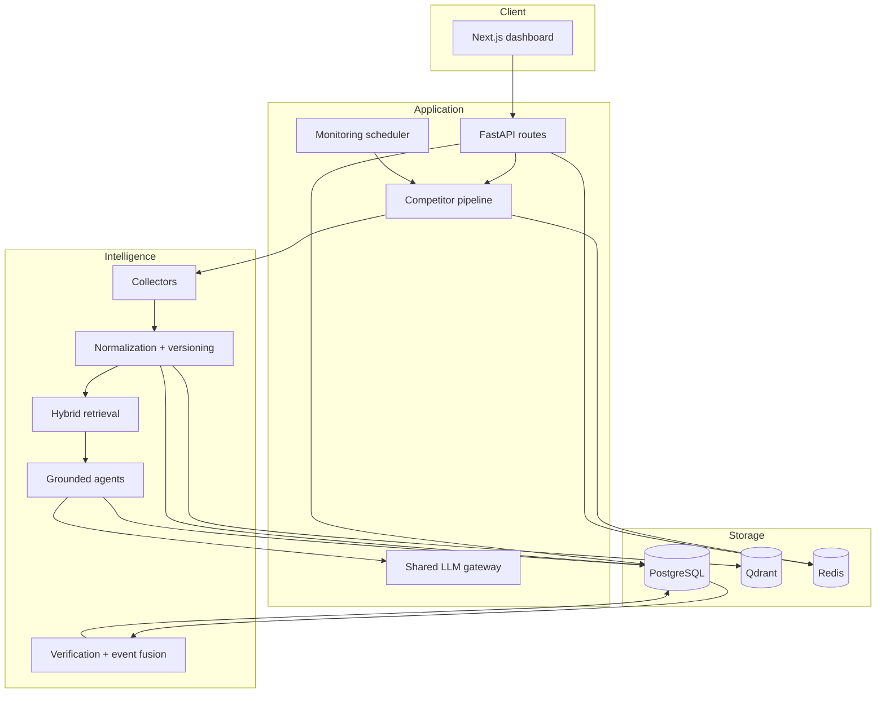

# Architecture

Scope Intelligence is a local-first modular monolith. FastAPI coordinates
collection and analysis, PostgreSQL stores durable state, Redis carries
short-lived pipeline status, Qdrant provides semantic retrieval, and Next.js
provides the operator workspace.

## Component map



## Pipeline

1. **Discovery** creates or resolves a company identity from a name. Official
   domain verification improves confidence but is not required.
2. **Ingestion** starts a durable collection campaign and gathers first-party
   pages, public news, jobs, feeds, and configured external sources.
3. **Normalization** creates canonical documents, immutable versions, chunks,
   evidence records, source profiles, and collection diagnostics.
4. **Retrieval** combines PostgreSQL full-text search and Qdrant semantic search
   using reciprocal-rank fusion and diversity limits.
5. **Analysis** asks one shared model for schema-constrained summaries, signals,
   predictions, entities, relationships, and investigations.
6. **Validation** rejects malformed or uncited structured outputs and permits a
   bounded repair attempt.
7. **Verification** recalculates claim confidence from source reliability,
   independent domains, freshness, citations, and contradictions.
8. **Fusion** combines claims, signals, and material changes into a situation
   timeline.

Each run and task is persisted, so a browser refresh or process restart does
not erase execution history.

## Data model

The central lineage is:

```text
source profile
  -> collection campaign
  -> raw record
  -> document
  -> document version
  -> document chunk / evidence
  -> claim
  -> signal / prediction / relationship / event
```

Supported claims are citation-bound at transaction commit. Relationship edges
retain evidence links and temporal observations instead of being treated as
permanent facts.

## Shared model gateway

`llm_gateway/` resolves one active connection for every agent.

- Saved credentials are encrypted with Fernet before PostgreSQL storage.
- The master key lives in `LLM_MASTER_KEY` or the private `llm_secrets` volume.
- API responses expose only configuration state and whether a secret exists.
- OpenAI-compatible, Anthropic, and Google adapters share a small completion
  interface.
- Local `localhost` model URLs are translated to `host.docker.internal` inside
  the Docker API container.

## Trust boundaries

Collected pages, feeds, PDFs, transcripts, model output, and source metadata
are untrusted input. They must not grant permissions, alter system prompts,
select credentials, or trigger external actions.

The default Docker ports bind to loopback. Scope Intelligence currently has no
multi-user authentication layer and must not be exposed directly to the public
internet.

## Extension points

- Add a public source adapter in `agents/ingestion/` and register its source
  profile behavior.
- Add deterministic intelligence logic in `intelligence/`.
- Add an AI agent under `agents/analysis/` by extending
  `BaseAnalysisAgent`; use retrieved evidence and structured validation.
- Add a provider adapter in `llm_gateway/providers.py`.
- Add schema changes as the next numbered additive file in `db/migrations/`.

See [CONTRIBUTING.md](../CONTRIBUTING.md) for review requirements.
